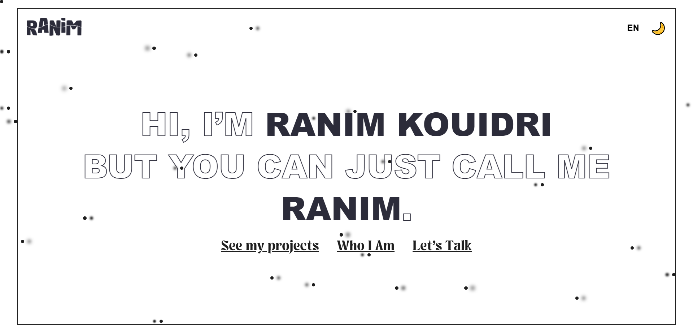

# My Portfolio

A modern, sleek front-end portfolio showcasing my projects and coding skills.  
Built with clean HTML, CSS, and JavaScript, featuring responsive design, interactive elements, and a minimal aesthetic.

## Preview



## Live Demo

Check it out live here: [Portfolio](https://Ranim-K.github.io/Portfolio/)

## Features

- Modern, responsive design
- Interactive UI elements
- Clean, maintainable code
- Built with HTML, CSS, and JavaScript

## Usage

Clone the repository and open `index.html` in your browser:

```bash
git clone https://github.com/Ranim-K/Portfolio.git
cd Portfolio
open index.html
